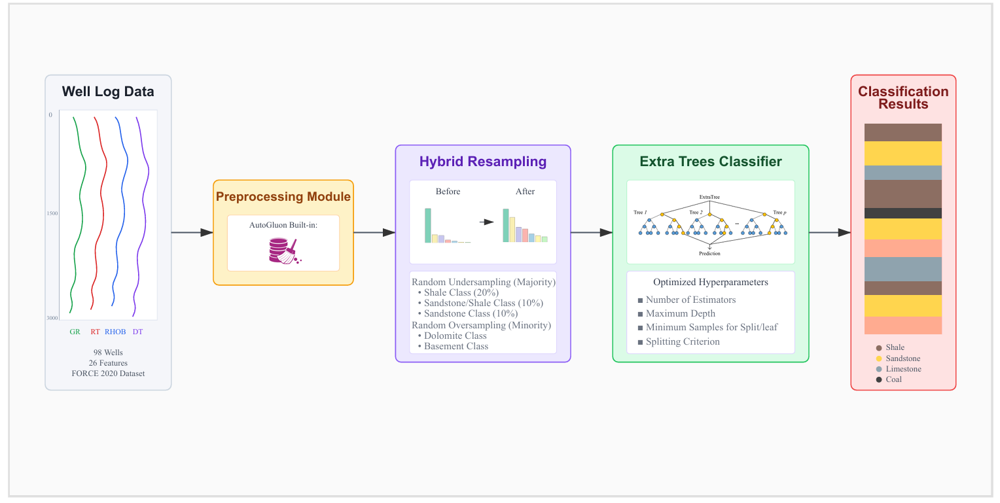

# Balanced Learning with Optimized Extra Trees Classifier for Reliable Lithology Identification in Imbalanced Well Log Data

This repository contains the source code for the paper "Balanced Learning with Optimized Extra Trees Classifier for Reliable Lithology Identification in Imbalanced Well Log Data" published in 15th International Conference on Computer and Knowledge Engineering (ICCKE 2025) by [Ali Daneshpour](https://scholar.google.com/citations?hl=en&user=ElqQdEUAAAAJ), [Behnam Yousefimehr](https://scholar.google.com/citations?user=hGwu7KAAAAAJ&hl=en), [Mehdi Ghatee*](https://scholar.google.com/citations?user=b7lfEJwAAAAJ&hl=en). This paper is available at [here](https://ieeexplore.ieee.org/abstract/document/10319392/).




## Citation
If you find this repository useful in your research, please cite our following paper:
```
@article{Daneshpour2025,
  title={Balanced Learning with Optimized Extra Trees Classifier for Reliable Lithology Identification in Imbalanced Well Log Data},
  author={Feng, Yifan and Ji, Shuyi and Liu, Yu-Shen and Du, Shaoyi and Dai, Qionghai and Gao, Yue},
  journal={IEEE Transactions on Pattern Analysis and Machine Intelligence},
  year={2025},
  publisher={IEEE}
}
